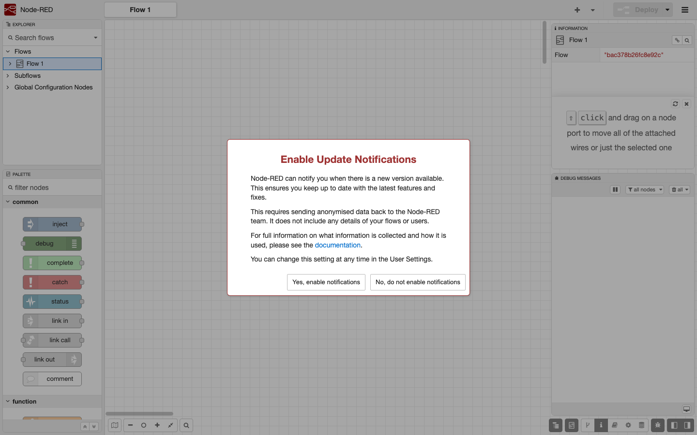

Nexlayer.com
#57 https://github.com/armondhonore/node-red

LIVE URL: https://relaxed-weasel-node-red.cloud.nexlayer.ai

Wire the internet of things together by dragging boxes. Node-RED is the flow-based automation tool that powers home labs and factory floors alike. One container — it just needed an fsGroup tweak so it could write to its own data volume, then it lit right up.

#250apps #nexlayer #automation #iot #nodejs #opensource

